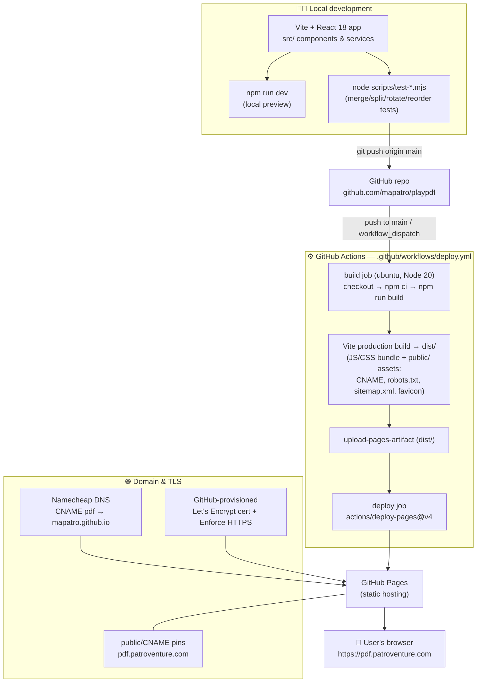
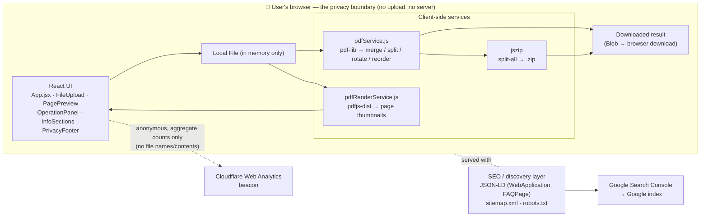

# playPDF — Development & Deployment Architecture

playPDF is a privacy-first, 100% client-side PDF toolkit (merge / split /
rotate / reorder). It is a subproject of **PatroVenture** and ships as a
static site to GitHub Pages on the custom domain `pdf.patroventure.com`.

## 1. End-to-end pipeline: development → deployment

## 2. Runtime architecture & privacy boundary

Everything that touches a PDF runs **inside the user's browser**. Files are
never uploaded — there is no backend.

## 3. Tech stack summary

| Layer | Choice |
|-------|--------|
| UI framework | React 18 |
| Build tool | Vite (`base: '/'`, custom domain) |
| Styling | Tailwind CSS v4 (light-orange project theme) |
| PDF engine | `pdf-lib` (manipulation), `pdfjs-dist` (rendering) |
| Zip | `jszip` (split-every-page) |
| Hosting | GitHub Pages (static) |
| CI/CD | GitHub Actions → `deploy-pages` on push to `main` |
| Domain/TLS | Namecheap DNS CNAME + GitHub Let's Encrypt |
| Analytics | Cloudflare Web Analytics (cookieless) |
| Discovery | JSON-LD + sitemap/robots + Google Search Console |

## 4. Key design property

**No server, no upload.** The absence of a backend is the core feature, not
an omission: PDFs are read into memory, processed via WebAssembly/JS, and
the result is handed straight back as a browser download. Only anonymous,
bucketed usage counters (never file names or contents) leave the device.
